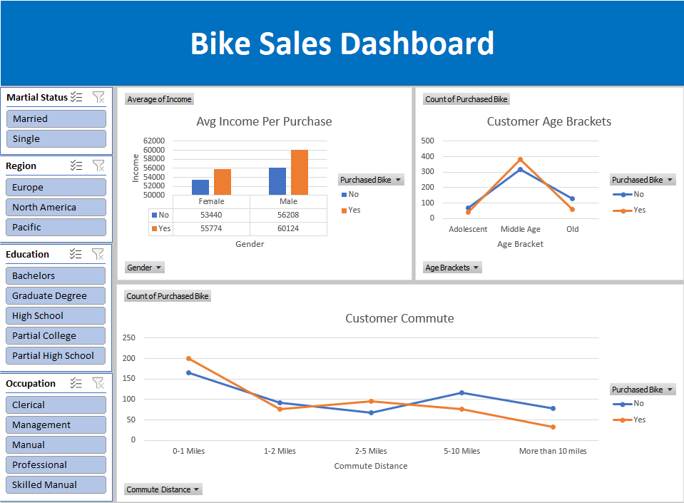

# Bike Sales Dashboard Analysis

## Executive Summary

This project analyzes customer purchasing behavior using a bike sales dataset and an interactive Excel dashboard. The dataset was cleaned, transformed, and visualized to uncover trends related to customer demographics, income levels, commute distance, and purchasing patterns.

The dashboard enables dynamic filtering through slicers for marital status, region, education, and occupation, allowing users to quickly explore customer segments and identify patterns influencing bike purchases. Key findings indicate that income, age group, and commute distance all play a significant role in customer buying behavior.

## Business Problem

The goal of this project was to identify the key demographic and lifestyle factors that influence bike purchases. Businesses in the retail and transportation industries need data-driven insights to better understand their customers and improve marketing strategies, product targeting, and sales performance.

Without proper analysis, it is difficult to determine:

- Which customer groups are most likely to purchase bikes
- How income and gender impact purchasing behavior
- Whether commute distance influences bike buying decisions
- Which demographic segments should be prioritized for marketing campaigns

This dashboard provides a centralized and interactive way to explore these insights and support better business decisions.

## Methodology

The project followed a structured data analysis workflow using Microsoft Excel:

### 1. Data Cleaning
- Removed duplicate records to improve data quality
- Standardized marital status values:
  - M → Married
  - S → Single
- Removed unnecessary decimal formatting from currency fields
- Reviewed dataset consistency and formatting
### 2. Data Transformation
- Created customer age brackets using nested IF statements and logical conditions
- Grouped customers into categorized age ranges for easier analysis
### 3. Data Analysis
- Built Pivot Tables to summarize customer purchasing trends
- Analyzed:
  - Average income by gender and bike purchase behavior
  - Customer age groups and purchase frequency
  - Commute distance and bike purchase trends
### 4. Dashboard Development
- Designed an interactive Excel dashboard
- Added slicers for:
  -  Marital Status
  -  Region
  -  Education
  -  Occupation
- Created dynamic charts connected to Pivot Tables
- Enabled real-time filtering for user-driven analysis
  
## Skills

This project demonstrates the following technical and analytical skills:
- Microsoft Excel
- Data Cleaning
- Data Transformation
- Pivot Tables
- Pivot Charts
- Dashboard Design
- Data Visualization
- Slicers & Interactive Filtering
- Nested IF Functions
- Business Analysis
- Data Storytelling
- Customer Segmentation
- Analytical Thinking

## Results & Business Recommendation
### Key Findings
- Customers with higher average incomes were more likely to purchase bikes
- Middle-aged customer groups showed stronger purchasing activity compared to younger and older groups
- Commute distance appeared to influence bike purchasing behavior, particularly among customers with moderate commuting ranges
- Demographic filters revealed noticeable differences across regions, education levels, and occupations

## Business Recommendations
- Focus marketing campaigns on middle-income to higher-income customer segments
- Target middle-aged demographics with personalized promotions and financing options
- Promote bikes as commuting solutions for customers with short-to-moderate travel distances
- Use demographic segmentation to create region-specific and occupation-specific marketing strategies
- Continue leveraging dashboard analytics to monitor customer behavior trends over time

## Next Steps
To further enhance this project, future improvements could include:
- Automating data cleaning processes using Power Query
- Expanding the dashboard with additional KPIs and performance metrics
- Integrating predictive analysis to forecast bike purchases
- Connecting Excel to external data sources for real-time updates
- Migrating the dashboard to Power BI for more advanced analytics and visualization capabilities
- Adding customer trend analysis over time for deeper business insights
